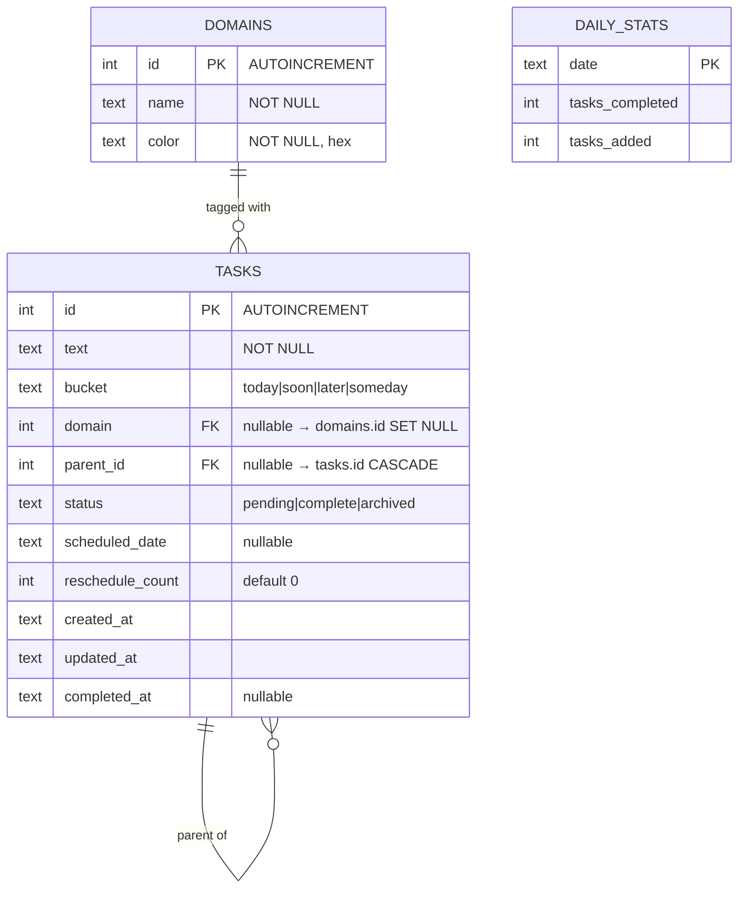

# Dynamic Domains & Sub-tasks

## Overview

Two features that expand Tend's capability while preserving its "conscious simplicity" philosophy:

1. **Dynamic Domains**: Expand from 3 hardcoded domains to user-managed domains (up to 5). Add create/delete capabilities to the existing edit flow in Settings.
2. **Sub-tasks**: Allow any task to have child tasks (1 level deep max). Keeps the original "rewrite it as multiple tasks" spirit but provides structure.

Both features share a single database migration since SQLite requires table recreation to change constraints.

## Problem Statement / Motivation

**Domains**: The hardcoded 3-domain limit (`Work / Admin / Calling`) doesn't fit everyone. Some users need 4-5 life areas. Others want to rename/remove defaults. Currently the schema enforces `CHECK (id IN (1, 2, 3))` at the database level, making this impossible without a migration.

**Sub-tasks**: When a task is too big ("Plan vacation"), users currently create separate unrelated tasks. There's no way to see that "Book flights," "Reserve hotel," and "Pack bags" are parts of the same effort. One level of nesting solves this without becoming a project management tool.

---

## Technical Approach

### Critical Prerequisite: Enable SQLite Foreign Keys

**This is the most important finding from analysis.** SQLite has foreign key enforcement OFF by default. The current `db.rs` does not enable it. Without `PRAGMA foreign_keys = ON`, neither `ON DELETE SET NULL` (domain deletion) nor `ON DELETE CASCADE` (parent task deletion) will work — they'll silently do nothing.

**Fix in `db.rs`:**
```rust
let opts = SqliteConnectOptions::from_str(&db_url)?
    .journal_mode(sqlx::sqlite::SqliteJournalMode::Wal)
    .foreign_keys(true)  // <-- ADD THIS
    .create_if_missing(true);
```

### Architecture: Combined Migration

Both features require recreating the `tasks` table (SQLite can't `ALTER TABLE ... DROP CONSTRAINT` or add FKs via `ALTER TABLE`). Combining them into one migration avoids two expensive table copies.

**`migrations/002_dynamic_domains_and_subtasks.sql`:**

```sql
-- 1. Enable foreign keys for this connection
PRAGMA foreign_keys = OFF;

-- 2. Recreate domains table without CHECK(id IN (1,2,3))
CREATE TABLE domains_new (
    id    INTEGER PRIMARY KEY AUTOINCREMENT,
    name  TEXT NOT NULL,
    color TEXT NOT NULL
);
INSERT INTO domains_new (id, name, color) SELECT id, name, color FROM domains;
DROP TABLE domains;
ALTER TABLE domains_new RENAME TO domains;

-- 3. Recreate tasks table:
--    - Remove CHECK(domain IN (1,2,3))
--    - Add FK: domain → domains(id) ON DELETE SET NULL
--    - Add parent_id with FK → tasks(id) ON DELETE CASCADE
CREATE TABLE tasks_new (
    id               INTEGER PRIMARY KEY AUTOINCREMENT,
    text             TEXT NOT NULL,
    bucket           TEXT NOT NULL DEFAULT 'today'
                     CHECK (bucket IN ('today', 'soon', 'later', 'someday')),
    domain           INTEGER REFERENCES domains(id) ON DELETE SET NULL,
    parent_id        INTEGER REFERENCES tasks(id) ON DELETE CASCADE,
    status           TEXT NOT NULL DEFAULT 'pending'
                     CHECK (status IN ('pending', 'complete', 'archived')),
    scheduled_date   TEXT,
    reschedule_count INTEGER NOT NULL DEFAULT 0,
    created_at       TEXT NOT NULL DEFAULT (strftime('%Y-%m-%dT%H:%M:%SZ', 'now')),
    updated_at       TEXT NOT NULL DEFAULT (strftime('%Y-%m-%dT%H:%M:%SZ', 'now')),
    completed_at     TEXT
);

INSERT INTO tasks_new (id, text, bucket, domain, status, scheduled_date,
    reschedule_count, created_at, updated_at, completed_at)
SELECT id, text, bucket, domain, status, scheduled_date,
    reschedule_count, created_at, updated_at, completed_at
FROM tasks;

DROP TABLE tasks;
ALTER TABLE tasks_new RENAME TO tasks;

-- 4. Recreate indexes
CREATE INDEX IF NOT EXISTS idx_tasks_bucket_status ON tasks(bucket, status);
CREATE INDEX IF NOT EXISTS idx_tasks_updated ON tasks(updated_at, status);
CREATE INDEX IF NOT EXISTS idx_tasks_parent ON tasks(parent_id);

-- 5. Re-enable foreign keys
PRAGMA foreign_keys = ON;
```

### ERD After Migration



---

## Implementation Phases

### Phase 1: Database & Backend Foundation

**Migration + FK pragma + new commands. No frontend changes yet.**

#### 1a. Enable foreign keys in db.rs

Add `.foreign_keys(true)` to `SqliteConnectOptions`.

- **File**: `src-tauri/src/db.rs`

#### 1b. Create migration 002

Combined migration as described above.

- **File**: `src-tauri/migrations/002_dynamic_domains_and_subtasks.sql`

#### 1c. Update models

Add `parent_id: Option<i64>` to the Rust `Task` struct.

- **File**: `src-tauri/src/models.rs`

#### 1d. Add domain CRUD commands

```rust
// create_domain(name, color) → Domain
// - Validate: COUNT(*) < 5, name not empty
// - Return new domain with auto-incremented ID

// delete_domain(id) → ()
// - FK cascade sets tasks.domain = NULL automatically
// - Validate domain exists (rows_affected check)
```

- **File**: `src-tauri/src/commands.rs`

#### 1e. Add error variants

```rust
pub enum Error {
    // ... existing ...
    #[error("domain limit reached (max 5)")]
    DomainLimitReached,

    #[error("nesting too deep: sub-tasks cannot have children")]
    NestingTooDeep,
}
```

- **File**: `src-tauri/src/error.rs`

#### 1f. Update create_task for parent_id

Accept optional `parent_id`. Validate:
- Parent exists
- Parent has no parent itself (enforce 1-level max)
- Sub-task inherits bucket and domain from parent (ignore passed values)

- **File**: `src-tauri/src/commands.rs`

#### 1g. Update defer_task to cascade to children

When deferring a parent, also move all children to the same bucket.

```rust
// After updating parent:
sqlx::query("UPDATE tasks SET bucket = ?, updated_at = ? WHERE parent_id = ?")
    .bind(&new_bucket)
    .bind(&ts)
    .bind(id)
    .execute(&mut *tx)
    .await?;
```

- **File**: `src-tauri/src/commands.rs`

#### 1h. Update complete_task to cascade to children

When completing a parent, auto-complete all pending children.

```rust
// After updating parent:
sqlx::query(
    "UPDATE tasks SET status = 'complete', completed_at = ?, updated_at = ?
     WHERE parent_id = ? AND status = 'pending'"
)
.bind(&ts).bind(&ts).bind(id)
.execute(&mut *tx)
.await?;
```

- **File**: `src-tauri/src/commands.rs`

#### 1i. Update reaper to handle parent-child

Archive children along with their parent. Add a second pass:

```rust
// After archiving stale parents:
sqlx::query(
    "UPDATE tasks SET status = 'archived', updated_at = strftime(...)
     WHERE parent_id IN (SELECT id FROM tasks WHERE status = 'archived')"
)
```

- **File**: `src-tauri/src/reaper.rs`

#### 1j. Register new commands in lib.rs

Add `create_domain`, `delete_domain` to `generate_handler![]`.

- **File**: `src-tauri/src/lib.rs`

---

### Phase 2: Frontend — Dynamic Domains

#### 2a. Update api.ts

Add `createDomain(name: string, color: string)` and `deleteDomain(id: number)` wrappers. Add `parent_id: number | null` to `Task` interface.

- **File**: `src/api.ts`

#### 2b. Fix domain dot cycle in task-input.ts

Replace hardcoded `1 → 2 → 3` with dynamic iteration over the domains array:

```typescript
// Current (broken for dynamic domains):
if (selectedDomain === null) selectedDomain = 1;
else if (selectedDomain < 3) selectedDomain++;
else selectedDomain = null;

// New:
const idx = domains.findIndex(d => d.id === selectedDomain);
selectedDomain = idx === -1 ? domains[0]?.id ?? null
               : idx < domains.length - 1 ? domains[idx + 1].id
               : null;
```

- **File**: `src/components/task-input.ts`

#### 2c. Settings: add create/delete domain UI

- "Add domain" button below existing rows (visible when count < 5)
- Clicking creates a domain with default color and focuses the name input
- Delete button (x) on each row, with confirmation: "Untag N tasks and delete?"
- Update hint text from "three" to "five"

- **File**: `src/views/settings.ts`
- **File**: `src/styles.css` (add domain button, delete button styles)

#### 2d. Fix welcome screen in today.ts

Replace hardcoded `domains[0]`, `[1]`, `[2]` with a dynamic loop:

```typescript
const legendDots = domains.map(d =>
  `<span class="legend-dot" style="background:${d.color}"></span> ${d.name}`
).join(' &nbsp; ');
```

Handle 0 domains gracefully (hide legend section).

- **File**: `src/views/today.ts`

#### 2e. Clear stale domain filter

After returning from Settings, check if `activeDomainFilter` still references a valid domain. If not, reset to `null`.

- **File**: `src/views/today.ts`

---

### Phase 3: Frontend — Sub-tasks

#### 3a. Sub-task creation UI

Add a "+" button to each task item (visible on hover, like the delete button). Clicking inserts an inline text input below the parent task. Submit creates a sub-task with `parent_id` set.

- The "+" button only appears on top-level tasks (tasks where `parent_id === null`)
- Sub-task input does NOT show the domain dot cycle (inherits from parent)

- **File**: `src/components/task-item.ts`
- **File**: `src/styles.css` (add button, inline input, indentation)

#### 3b. Task list rendering with hierarchy

In `today.ts` and `renderBucket`, group tasks by parent:

```typescript
// Separate top-level and children
const topLevel = filtered.filter(t => !t.parent_id);
const children = filtered.filter(t => t.parent_id);
const childrenByParent = new Map<number, Task[]>();
for (const c of children) {
  const group = childrenByParent.get(c.parent_id!) || [];
  group.push(c);
  childrenByParent.set(c.parent_id!, group);
}

// Render: parent, then its children indented
for (const task of topLevel) {
  list.appendChild(renderTaskItem(task, domains, onUpdate));
  const subs = childrenByParent.get(task.id) || [];
  for (const sub of subs) {
    const subEl = renderTaskItem(sub, domains, onUpdate);
    subEl.classList.add('task-subtask');
    list.appendChild(subEl);
  }
}
```

- **File**: `src/views/today.ts`
- **File**: `src/styles.css` (`.task-subtask { padding-left: 28px; }`)

#### 3c. Parent task progress indicator

When a parent has children, show a count like "(2/5)" next to the task text in `task-item.ts`. This requires passing the children array or count to the render function.

- **File**: `src/components/task-item.ts`

#### 3d. Triage: sub-tasks triaged with parent

Modify `get_triage_tasks` to exclude sub-tasks (only return tasks where `parent_id IS NULL`). When rendering the triage card for a parent, show its sub-tasks as context below the task text.

**Backend:**
```sql
SELECT * FROM tasks
WHERE bucket = 'today' AND status = 'pending' AND parent_id IS NULL
ORDER BY created_at ASC
```

**Frontend triage card:** Below the task text, list sub-tasks:
```
"Plan vacation"
  ☐ Book flights
  ☐ Reserve hotel
  ☑ Research destinations
Created 3 days ago · Deferred 1x
```

When the user defers/completes/kills the parent, all children follow.

- **File**: `src-tauri/src/commands.rs` (update `get_triage_tasks` query)
- **File**: `src/views/triage.ts` (render sub-task context on card)

#### 3e. Honest nudge: count top-level only

Update the nudge to count only top-level pending tasks:

```typescript
const topLevelPending = pending.filter(t => !t.parent_id);
// Use topLevelPending.length for nudge text
```

- **File**: `src/views/today.ts`

#### 3f. Delete parent confirmation

When deleting a parent that has children, show a simple confirm before proceeding.

- **File**: `src/components/task-item.ts`

---

## Design Decisions (Recorded)

| Decision | Choice | Rationale |
|----------|--------|-----------|
| Sub-task nesting depth | 1 level max | Stays aligned with simplicity philosophy |
| Domain delete behavior | Untag tasks (SET NULL) | No data loss, simplest mental model |
| Max domains | 5 | Enough flexibility without proliferation |
| Min domains | 0 allowed | Hide domain UI when empty; app works fine untagged |
| Sub-task in triage | Triaged with parent, not individually | Prevents hierarchy splitting across buckets |
| Parent deferred → children | Children follow to same bucket | Keeps hierarchy together |
| Parent completed → children | Auto-complete pending children | Simplest behavior, no orphans |
| All children done → parent | No auto-complete; show progress indicator | Conscious completion (user must decide) |
| Sub-task domains | Inherit from parent (not independent) | Keeps model simple, no filtering edge cases |
| Honest nudge counting | Top-level tasks only | Honest without inflation from sub-tasks |
| Domain delete confirmation | Yes, with affected task count | Irreversible action deserves conscious choice |
| Sub-task creation | "+" button on hover, inline input below parent | Frictionless, consistent with existing patterns |
| Combined migration | Yes, one migration for both features | Avoids two expensive table recreations |

---

## Acceptance Criteria

### Dynamic Domains
- [ ] User can create a new domain in Settings (name + color)
- [ ] User can delete a domain in Settings (with confirmation showing task count)
- [ ] Maximum 5 domains enforced (Add button disabled at 5)
- [ ] Deleting a domain untags all associated tasks
- [ ] Domain dot cycle in task input works with any number of domains (0-5)
- [ ] Domain filters in header work with any number of domains
- [ ] Welcome screen renders dynamically for 0-5 domains
- [ ] `activeDomainFilter` resets when its domain is deleted

### Sub-tasks
- [ ] User can add a sub-task to any top-level task via "+" button
- [ ] Sub-tasks appear indented below their parent
- [ ] Sub-tasks cannot have children (1-level enforced in backend)
- [ ] Completing a parent auto-completes all pending children
- [ ] Deleting a parent deletes all children (with confirmation)
- [ ] Deferring a parent moves all children to the same bucket
- [ ] Sub-tasks are triaged with their parent (not individually)
- [ ] Sub-tasks inherit domain from parent
- [ ] Parent shows progress indicator "(2/5)" when it has children
- [ ] Honest nudge counts only top-level tasks
- [ ] Reaper archives children along with stale parents

### Infrastructure
- [ ] `PRAGMA foreign_keys = ON` enabled in db.rs
- [ ] Migration 002 runs cleanly on existing databases
- [ ] All existing tasks preserved with `parent_id = NULL`
- [ ] All existing domains preserved with auto-increment IDs

---

## Risk Analysis

| Risk | Likelihood | Impact | Mitigation |
|------|-----------|--------|------------|
| Migration data loss | Low | Critical | Use CREATE-SELECT-DROP-RENAME pattern; test on copy of production DB |
| FK pragma not set on all connections | Medium | Critical | Set in `SqliteConnectOptions`, not in migration SQL |
| Domain ID gaps after delete/create cycles | Certain | Low | All code uses domain objects, never hardcoded IDs |
| Sub-task rendering performance with many children | Low | Low | 1-level limit caps depth; index on parent_id |
| Philosophy creep (sub-tasks become project management) | Medium | Medium | 1-level hard limit; no drag-drop reordering; no dependencies |

---

## Files Changed Summary

| File | Feature | Change |
|------|---------|--------|
| `src-tauri/src/db.rs` | Both | Add `.foreign_keys(true)` |
| `src-tauri/migrations/002_...sql` | Both | NEW: Combined schema migration |
| `src-tauri/src/models.rs` | Sub-tasks | Add `parent_id` to Task |
| `src-tauri/src/error.rs` | Both | Add DomainLimitReached, NestingTooDeep |
| `src-tauri/src/commands.rs` | Both | New domain CRUD, parent_id support, cascade behaviors |
| `src-tauri/src/reaper.rs` | Sub-tasks | Archive children with parents |
| `src-tauri/src/lib.rs` | Domains | Register new commands |
| `src/api.ts` | Both | New wrappers, parent_id on Task |
| `src/components/task-input.ts` | Domains | Dynamic dot cycle |
| `src/components/task-item.ts` | Both | "+" button, progress indicator, delete confirmation |
| `src/views/settings.ts` | Domains | Create/delete domain UI |
| `src/views/today.ts` | Both | Dynamic welcome, hierarchical rendering, nudge fix |
| `src/views/triage.ts` | Sub-tasks | Sub-task context on parent cards |
| `src/styles.css` | Both | Sub-task indentation, domain management styles |

---

## References

- Design philosophy: `/Users/brandon/.claude/plans/sprightly-zooming-island.md`
- sqlx best practices: `docs/solutions/code-quality/rust-backend-refactor-sqlx-best-practices.md`
- Tauri patterns: `~/.claude/knowledge-base/tauri.md`
- Domain modeling: `~/.claude/knowledge-base/domain-modeling.md`
- SQLite FK docs: https://www.sqlite.org/foreignkeys.html
